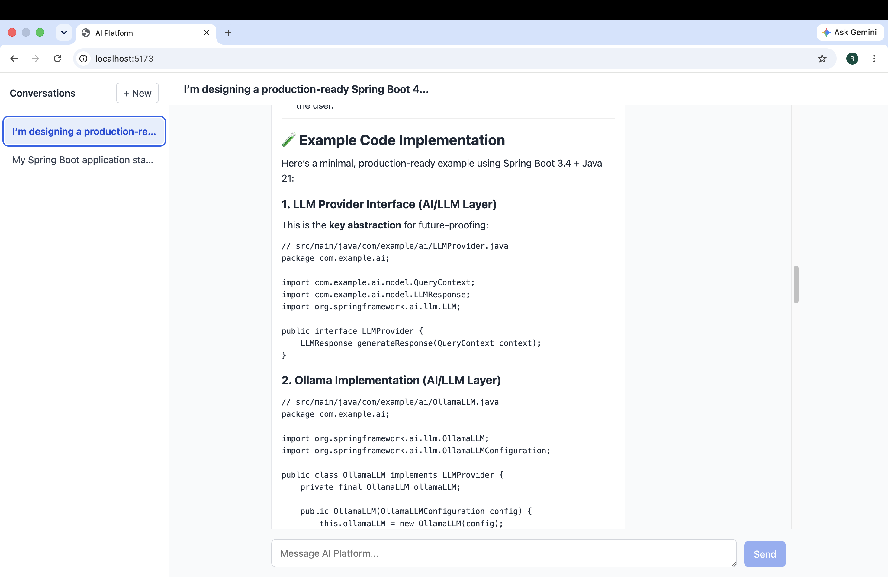
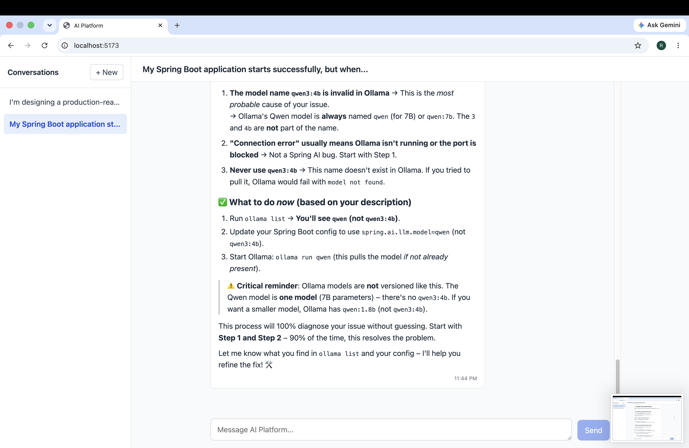

# AI Platform

<p align="center">
  
  
</p>

A full-stack conversational AI application built with **Spring Boot, Spring AI, Ollama, PostgreSQL, React, TypeScript, and Vite**.

The application provides persistent AI conversations with conversation history, Markdown responses, syntax-highlighted code blocks, and progressively streamed AI responses.

## Current Status

| Feature                         | Status          |
| ------------------------------- | --------------- |
| Spring Boot backend             | Implemented     |
| PostgreSQL persistence          | Implemented     |
| Conversation creation           | Implemented     |
| Conversation listing            | Implemented     |
| Conversation history            | Implemented     |
| Synchronous AI responses        | Implemented     |
| Streaming AI responses          | Implemented     |
| Ollama integration              | Implemented     |
| Spring AI integration           | Implemented     |
| React frontend                  | Implemented     |
| TypeScript frontend             | Implemented     |
| Markdown rendering              | Implemented     |
| Syntax highlighting             | Implemented     |
| Streaming response UI           | Implemented     |
| Continuous integration workflow | Configured      |
| Authentication                  | Not implemented |
| RAG                             | Not implemented |
| Multi-model selection           | Not implemented |
| Production deployment           | Not implemented |

---

## Architecture

```text
                         ┌──────────────────────┐
                         │    React Frontend    │
                         │   React + TypeScript │
                         │       + Vite         │
                         └──────────┬───────────┘
                                    │
                             HTTP / Streaming
                                    │
                                    ▼
                         ┌──────────────────────┐
                         │   Spring Boot API    │
                         │                      │
                         │  ChatController      │
                         │        │             │
                         │  ChatService         │
                         └──────┬───────┬───────┘
                                │       │
                         Spring AI      │ JPA
                                │       │
                                ▼       ▼
                         ┌──────────┐ ┌──────────┐
                         │  Ollama  │ │PostgreSQL│
                         │ qwen3:4b │ │          │
                         └──────────┘ └──────────┘
```

### Request Flow

For a normal message:

```text
React
  │
  │ POST /api/conversations/{id}/messages
  ▼
Spring Boot
  │
  ├── Save USER message
  │
  ├── Load conversation history
  │
  ├── Build Spring AI Prompt
  │
  ├── Send prompt to Ollama
  │
  ├── Receive AI response
  │
  └── Save ASSISTANT message
  │
  ▼
React
```

For a streaming response:

```text
React
  │
  │ POST /api/conversations/{id}/messages/stream
  ▼
Spring Boot
  │
  ├── Save USER message
  │
  ├── Load conversation history
  │
  └── Stream response from Ollama
          │
          ▼
      Spring AI Flux
          │
          ▼
      HTTP streaming
          │
          ▼
        React
          │
          ├── Receive chunks
          ├── Accumulate response
          └── Render progressively
```

---

## Technology Stack

### Backend

| Technology      | Version / Role      |
| --------------- | ------------------- |
| Java            | 21                  |
| Spring Boot     | 4.1.0               |
| Spring AI       | 2.0.0               |
| Spring Web MVC  | REST API            |
| Spring WebFlux  | Reactive streaming  |
| Spring Data JPA | Persistence         |
| Flyway          | Database migrations |
| PostgreSQL      | Database            |
| Maven           | Build               |
| Ollama          | Local LLM runtime   |
| qwen3:4b        | Current LLM model   |

### Frontend

| Technology               | Role                         |
| ------------------------ | ---------------------------- |
| React                    | UI                           |
| TypeScript               | Type safety                  |
| Vite                     | Development server and build |
| react-markdown           | Markdown rendering           |
| react-syntax-highlighter | Code highlighting            |
| Fetch API                | Backend communication        |

### Infrastructure

| Technology     | Role                        |
| -------------- | --------------------------- |
| Docker         | PostgreSQL container        |
| PostgreSQL     | Persistent application data |
| Ollama         | Local LLM inference         |
| GitHub Actions | Continuous integration      |

---

## Application Design

The application separates the user interface, API layer, AI integration, and persistence layer.

### Backend

The Spring Boot backend is responsible for:

* Conversation management
* Message persistence
* Conversation history
* AI prompt construction
* Ollama integration
* Synchronous AI responses
* Streaming AI responses
* Database access
* Database migrations

### AI Integration

Spring AI provides the integration layer between the application and Ollama.

The current model configuration is:

```text
Ollama
└── qwen3:4b
```

Conversation history is loaded from PostgreSQL and converted into Spring AI messages before being sent to the model.

### Frontend

The React frontend provides:

* Conversation selection
* New conversation creation
* Message composition
* AI response rendering
* Markdown rendering
* Syntax highlighting
* Streaming response display

### Persistence

PostgreSQL stores:

* Conversations
* User messages
* Assistant messages
* Conversation timestamps

Spring Data JPA handles persistence and Flyway manages database schema migrations.

### Streaming

AI responses can be generated incrementally using Spring AI's reactive streaming API.

The backend exposes the generated content as a streaming HTTP response, which the React frontend consumes progressively.

---

## Markdown Rendering

Assistant responses are rendered as Markdown.

Supported content includes:

* Headings
* Paragraphs
* Bold text
* Italic text
* Ordered lists
* Unordered lists
* Blockquotes
* Inline code
* Fenced code blocks

Code blocks are syntax highlighted using `react-syntax-highlighter`.

For example:

````markdown
## Example

Here is a Java example:

```java
public class Example {
    public static void main(String[] args) {
        System.out.println("Hello");
    }
}
```
````

---

## Project Structure

```text
ai-platform/
│
├── .github/
│   └── workflows/
│       └── ci.yml
│
├── docs/
│   └── images/
│       ├── conversation1.png
│       └── conversation2.png
│
├── src/
│   ├── main/
│   │   ├── java/
│   │   │   └── com/bondocsystems/chat/
│   │   │       ├── config/
│   │   │       ├── controller/
│   │   │       ├── exception/
│   │   │       ├── model/
│   │   │       ├── repository/
│   │   │       └── service/
│   │   │
│   │   └── resources/
│   │       ├── application.yml
│   │       └── db/
│   │           └── migration/
│   │
│   └── test/
│       └── java/
│
├── frontend/
│   ├── src/
│   │   ├── components/
│   │   ├── services/
│   │   ├── types/
│   │   ├── App.tsx
│   │   └── main.tsx
│   ├── package.json
│   ├── tsconfig.json
│   └── vite.config.ts
│
├── compose.yaml
├── pom.xml
├── mvnw
├── mvnw.cmd
└── README.md
```

---

## Prerequisites

Install the following:

* Java 21 JDK
* Maven 3.9+ (optional when using the Maven Wrapper)
* Docker Desktop
* Node.js
* npm
* Ollama

Verify Java:

```bash
java -version
```

Verify Docker:

```bash
docker --version
docker compose version
```

Verify Node.js:

```bash
node --version
npm --version
```

Verify Ollama:

```bash
ollama --version
```

---

## Running Locally

The application runs locally as separate components:

```text
PostgreSQL
    │
    ▼
Spring Boot backend
    │
    ▼
React frontend

Ollama
    │
    └── Used by the Spring Boot backend for AI inference
```

The recommended development setup is:

```text
PostgreSQL    → Docker
Spring Boot   → Host machine
React/Vite    → Host machine
Ollama        → Host machine
```

### 1. Start PostgreSQL

From the repository root:

```bash
docker compose up -d postgres
```

Verify that PostgreSQL is running:

```bash
docker compose ps
```

The Spring Boot application expects PostgreSQL at:

```text
Host:     localhost
Port:     5432
Database: chat_db
Username: postgres
Password: password
```

The datasource configuration is defined in:

```text
src/main/resources/application.yml
```

Flyway automatically applies database migrations when the Spring Boot application starts.

### 2. Start Ollama

The application currently uses:

```text
qwen3:4b
```

Make sure Ollama is running.

Verify installed models:

```bash
ollama list
```

If the model is not installed:

```bash
ollama pull qwen3:4b
```

You can verify the model directly:

```bash
ollama run qwen3:4b
```

Exit with:

```text
/bye
```

The Spring Boot application connects to Ollama at:

```text
http://localhost:11434
```

### 3. Start the Spring Boot Backend

From the repository root:

```bash
./mvnw spring-boot:run
```

On Windows:

```bash
mvnw.cmd spring-boot:run
```

Alternatively, with Maven installed globally:

```bash
mvn spring-boot:run
```

The backend starts at:

```text
http://localhost:8080
```

On startup, Spring Boot will:

1. Connect to PostgreSQL
2. Run Flyway migrations
3. Initialize the application
4. Use Ollama when AI requests are made

### 4. Start the React Frontend

Open another terminal:

```bash
cd frontend
```

Install dependencies:

```bash
npm install
```

Start the Vite development server:

```bash
npm run dev
```

Vite will display a local URL similar to:

```text
http://localhost:5173/
```

Open that URL in your browser.

---

## Frontend Configuration

The frontend uses:

```text
VITE_API_BASE_URL
```

to determine the backend URL.

For local development:

```text
VITE_API_BASE_URL=http://localhost:8080
```

If necessary, create:

```text
frontend/.env
```

with:

```text
VITE_API_BASE_URL=http://localhost:8080
```

Restart the Vite development server after changing environment variables.

Do not commit local `.env` files containing secrets.

For frontend-specific implementation details, see [`frontend/README.md`](frontend/README.md).

---

## API

The primary API is organized around conversations.

Base path:

```text
/api/conversations
```

### Create a Conversation

```bash
curl -X POST \
  http://localhost:8080/api/conversations
```

The response contains a conversation UUID.

Example:

```json
{
  "id": "xxxxxxxx-xxxx-xxxx-xxxx-xxxxxxxxxxxx",
  "createdAt": "2026-09-05T00:00:00Z",
  "updatedAt": "2026-09-05T00:00:00Z"
}
```

Set the ID for subsequent requests:

```bash
CONVERSATION_ID="xxxxxxxx-xxxx-xxxx-xxxx-xxxxxxxxxxxx"
```

### Send a Message

```bash
curl -X POST \
  "http://localhost:8080/api/conversations/$CONVERSATION_ID/messages" \
  -H "Content-Type: text/plain" \
  -d "What is Spring Boot?"
```

The backend:

1. Validates the conversation
2. Saves the user message
3. Loads previous messages
4. Converts the conversation history into Spring AI messages
5. Sends the prompt to Ollama
6. Receives the AI response
7. Saves the assistant response

### Retrieve Conversation Messages

```bash
curl \
  "http://localhost:8080/api/conversations/$CONVERSATION_ID/messages"
```

Messages are returned in chronological order.

### List Conversations

```bash
curl \
  http://localhost:8080/api/conversations
```

---

## Streaming API

The application supports progressive AI response generation.

Endpoint:

```text
POST /api/conversations/{conversationId}/messages/stream
```

Example:

```bash
curl -N -X POST \
  "http://localhost:8080/api/conversations/$CONVERSATION_ID/messages/stream" \
  -H "Content-Type: text/plain" \
  -H "Accept: text/event-stream" \
  -d "Explain Java virtual threads in detail."
```

The `-N` option prevents `curl` from buffering the response so streamed content can be displayed progressively.

The backend uses Spring AI's reactive streaming API and accumulates the generated response before persisting the completed assistant message.

### Frontend Streaming

The React frontend consumes the streaming endpoint using the browser Fetch API.

The response is progressively accumulated into the current assistant message.

```text
Ollama
   │
   ▼
Spring AI
   │
   ▼
Spring Boot
   │
   │ streaming chunks
   ▼
Fetch API
   │
   ▼
React state
   │
   ▼
Assistant message
   │
   ▼
MarkdownRenderer
```

This allows the response to appear while the model is still generating it.

---

## Testing

### Backend

Run the backend test suite:

```bash
./mvnw test
```

For the full Maven verification lifecycle:

```bash
./mvnw verify
```

The Maven Wrapper is the recommended way to run backend verification because it uses the Maven version configured by the project.

### Frontend

Install dependencies:

```bash
cd frontend
npm ci
```

Build the production frontend:

```bash
npm run build
```

---

## Continuous Integration

The repository includes a GitHub Actions CI workflow at:

```text
.github/workflows/ci.yml
```

The workflow runs for pushes to `main` and `development`, and for pull requests targeting those branches.

The CI environment provides:

* Java 21
* Node.js 20
* PostgreSQL 16

The backend verification step runs:

```bash
./mvnw verify
```

The frontend dependencies are installed with:

```bash
npm ci
```

The frontend validation step runs:

```bash
npm run validate
```

The CI PostgreSQL service is configured with the same database connection values expected by the Spring Boot application:

```text
Database: chat_db
Username: postgres
Password: password
Port:     5432
```

The CI workflow does not require a locally running Ollama model because the automated backend verification does not perform live LLM inference.

---

## Database Persistence

PostgreSQL stores:

* Conversations
* User messages
* Assistant messages
* Conversation timestamps

Spring Data JPA handles persistence and Flyway manages database migrations.

Stopping or restarting the Spring Boot application does not remove stored conversations.

To stop PostgreSQL:

```bash
docker compose down
```

If persistent Docker volumes are configured, database data can remain available when the container is recreated.

---

## Stopping the Application

Stop the React development server:

```text
Ctrl+C
```

Stop the Spring Boot application:

```text
Ctrl+C
```

Stop PostgreSQL:

```bash
docker compose down
```

To stop PostgreSQL without removing the container:

```bash
docker compose stop postgres
```

Start it again with:

```bash
docker compose start postgres
```

---

## Troubleshooting

### PostgreSQL Connection Refused

Check the container:

```bash
docker compose ps
```

Check whether port 5432 is being used:

```bash
lsof -i :5432
```

The backend expects PostgreSQL at:

```text
localhost:5432
```

### Database Does Not Exist

The application expects:

```text
chat_db
```

Verify that the PostgreSQL container is configured with the same database name used by:

```text
src/main/resources/application.yml
```

### Ollama Connection Error

Check Ollama:

```bash
curl http://localhost:11434/api/tags
```

Then check installed models:

```bash
ollama list
```

Make sure:

```text
qwen3:4b
```

is available.

### Frontend Cannot Connect to Backend

Verify that Spring Boot is running:

```bash
curl http://localhost:8080/actuator/health
```

Then check:

```text
frontend/.env
```

for:

```text
VITE_API_BASE_URL=http://localhost:8080
```

Restart Vite after changing the frontend environment configuration.

### Streaming Does Not Appear Progressively

First test the backend directly with `curl`:

```bash
curl -N -X POST \
  "http://localhost:8080/api/conversations/$CONVERSATION_ID/messages/stream" \
  -H "Content-Type: text/plain" \
  -H "Accept: text/event-stream" \
  -d "Give me a long explanation of Java."
```

If the response streams correctly through `curl`, the backend and Ollama streaming pipeline are working. The issue is then likely in the frontend streaming client or UI rendering.

---

## Roadmap

Potential future improvements include:

* Authentication and authorization
* Conversation rename/delete
* Message regeneration
* Stop/cancel streaming
* Multi-model selection
* Model configuration
* Retrieval-Augmented Generation (RAG)
* Tool/function calling
* AI agents
* Observability
* Rate limiting
* Automated frontend tests
* Backend integration tests
* Production Docker image
* Production deployment

Features will be introduced incrementally as the application evolves.
