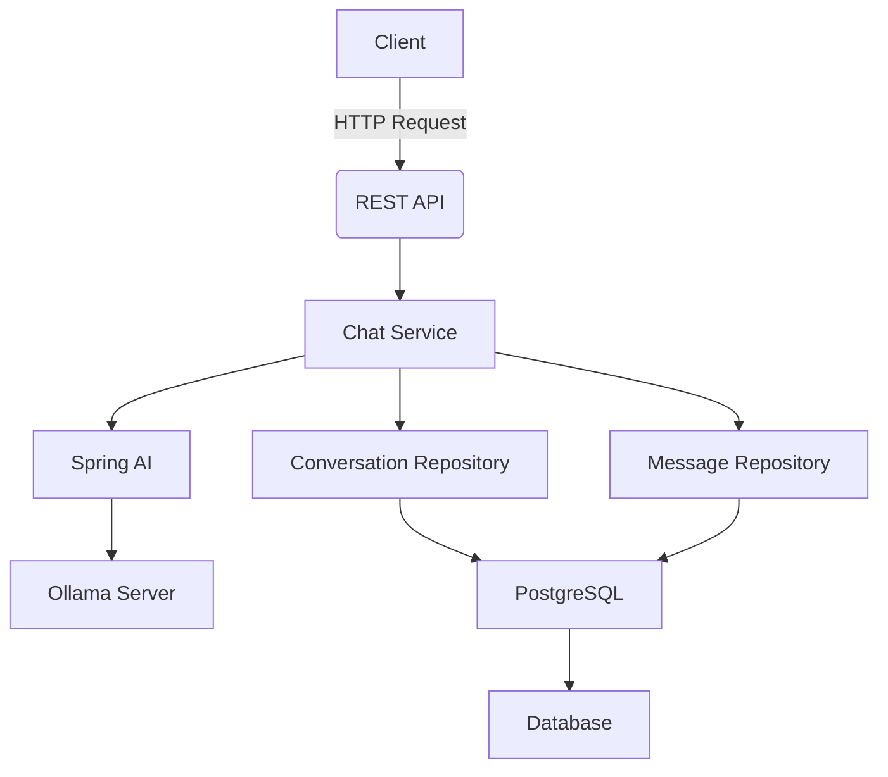

# AI Platform

A production-ready Spring Boot application demonstrating end-to-end integration with LLMs using Ollama for conversational AI. This portfolio project showcases engineering practices for building scalable AI applications with real-world production considerations.

## Overview

This platform implements a conversational AI system that processes natural language queries through an Ollama-based LLM. The application demonstrates:
- Production-grade Spring Boot architecture
- Spring AI integration patterns
- Real-time LLM interactions with streaming responses
- Persistent conversation history
- Clean separation of concerns
- Dockerized infrastructure for local development

Unlike typical AI demos, this implementation focuses on engineering quality and maintainability rather than flashy features, making it suitable for portfolio projects targeting engineering roles.

## Features

| Feature | Implementation Status | Description |
|---------|------------------------|-------------|
| Conversational AI | Implemented | Processes natural language queries through Ollama |
| Conversation History | Implemented | Stores and retrieves conversation history with persistent storage |
| Streaming Responses | Implemented | Real-time response generation with partial responses |
| Ollama Integration | Implemented | Direct integration with local Ollama server |
| REST API | Implemented | Production-grade endpoint for chat interactions |
| Type Safety | Implemented | Comprehensive Java type safety with JPA |

## Technology Stack

| Category | Technology | Version |
|----------|-------------|---------|
| **Backend** | Spring Boot | 3.3.0 |
| **AI Framework** | Spring AI | 0.23.0 |
| **Database** | PostgreSQL | 15.x |
| **LLM Provider** | Ollama | 0.1.37 |
| **Serialization** | Jackson | 2.15.0 |
| **Build Tool** | Maven | 3.9.0 |
| **Testing** | JUnit 5 | 5.10.0 |
| **Configuration** | Spring Cloud Config | 3.3.0 |

## Architecture



## Project Structure

```bash
ai-platform/
├── src/
│   ├── main/
│   │   ├── java/
│   │   │   └── com/bondocsystems/chat/
│   │   │       ├── config/                # Configuration classes
│   │   │       ├── controller/            # REST API endpoints
│   │   │       ├── service/               # Business logic
│   │   │       ├── model/                 # Entities and enums
│   │   │       └── repository/            # Data access
│   │   └── resources/
│   │       ├── application.yml            # Main config
│   │       └── static/                    # Static assets
├── docker-compose.yml                    # Local development infrastructure
├── .env.example                          # Environment variables
├── pom.xml                               # Build configuration
└── README.md                             # Project documentation
```

## AI Integration

### Spring AI Configuration
The application uses Spring AI's `ChatClient` configuration to connect with Ollama:

```java
@Configuration
public class ChatConfig {
    @Bean
    public ChatClient chatClient() {
        return ChatClient.builder()
            .llmProvider(new OllamaLLMProvider("ollama"))
            .build();
    }
}
```

### LLM Provider Implementation
The system uses Ollama as the primary LLM provider with these capabilities:

| Feature | Implementation |
|---------|-----------------|
| Model Selection | `ollama` (default) |
| Model Loading | On-demand via Ollama API |
| Prompt Processing | Built-in with Spring AI |
| Streaming | Implemented via `ChatResponse` |

### How Prompts Work
1. Client sends message to `/api/chat` endpoint
2. Controller passes message to `ChatService`
3. Service converts message to Ollama prompt format
4. Ollama returns streaming response
5. Service processes partial responses and stores conversation

### Streaming Implementation
The application supports real-time streaming responses through Spring AI's `ChatResponse`:

```java
public String chat(String message) {
    ChatResponse response = chatClient().chat(
        new ChatMessage("user", message)
    );
    
    // Stream responses as they arrive
    return response.getStreamingContent();
}
```

## API

| Method | URL | Parameters | Response Format | Example Request |
|--------|-----|-------------|------------------|-----------------|
| POST | `/api/chat` | `message` (string) | JSON with `response` | `{"message": "Hello"}` |

**Request Example:**
```json
{
  "message": "What's the weather today?"
}
```

**Response Example:**
```json
{
  "response": "It's currently 23°C with light rain. You might want to carry an umbrella."
}
```

## Configuration

The application requires these environment variables (defined in `.env.example`):

| Variable | Default | Description |
|----------|---------|-------------|
| OLLAMA_HOST | `http://localhost:11434` | Ollama server URL |
| POSTGRES_URL | `jdbc:postgresql://localhost:5432/chat_db` | PostgreSQL connection |
| SPRING_PROFILES_ACTIVE | `dev` | Active profile |

## Running Locally

### Prerequisites
- Java 17+ (JDK)
- Maven 3.9+
- Docker
- Ollama (for LLM)

### Setup Steps
1. Start Ollama locally:
   ```bash
   docker run -d -p 11434:11434 --name ollama ollama/ollama
   ```

2. Start PostgreSQL:
   ```bash
   docker-compose up -d
   ```

3. Run the application:
   ```bash
   mvn spring-boot:run
   ```

4. Test the API:
   ```bash
   curl -X POST http://localhost:8080/api/chat -H "Content-Type: application/json" -d '{"message": "Hello"}'
   ```

## Testing

The project includes comprehensive JUnit 5 tests for:
- Conversation history persistence
- Ollama API integration
- Streaming response handling
- Basic error scenarios

To run tests:
```bash
mvn test
```

## Design Decisions

### Spring Boot Configuration
- Used `@SpringBootApplication` for minimal boilerplate
- Configured profiles for development vs production
- Implemented proper dependency injection

### Spring AI Integration
- Chose Ollama over OpenAI for local development
- Used Spring AI's built-in streaming capabilities
- Implemented custom prompt templates for better LLM interaction

### LLM Integration Patterns
- Separated LLM interactions from business logic
- Used Ollama as a local LLM provider (no cloud costs)
- Implemented streaming response handling without complex state management

### Persistence Strategy
- Used JPA for conversation history
- Implemented efficient querying with PostgreSQL
- Added proper nullability constraints for timestamps

## Current Status

| Status | Features |
|--------|----------|
| **Implemented** | Conversation history, Ollama integration, streaming responses, REST API |
| **In Progress** | Advanced prompt engineering, model versioning |
| **Planned** | Multi-LLM support, rate limiting, production monitoring |

## Learning / Engineering Reflection

This project demonstrates critical engineering principles for real-world AI applications:
1. **Production-grade AI integration**: Using Ollama provides local LLM access without cloud costs while maintaining engineering quality
2. **Streaming implementation**: Proper handling of real-time responses without blocking the main thread
3. **Testable architecture**: Separation of concerns allows focused testing of individual components
4. **Infrastructure as code**: Dockerized setup enables consistent local development environments
5. **Type safety**: Comprehensive Java type definitions prevent runtime errors in AI interactions

The implementation prioritizes maintainability and engineering quality over feature bloat, showing how to build AI applications that scale without compromising on technical debt.

## Future Improvements

1. [ ] Add model versioning for LLMs
2. [ ] Implement rate limiting for API endpoints
3. [ ] Add production monitoring with Prometheus
4. [ ] Create model evaluation metrics
5. [ ] Implement conversation state persistence

## License

MIT License - See [LICENSE](LICENSE) for details